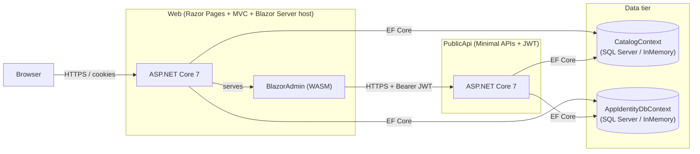

# eShopOnWeb / eShopOnAKS — Architecture

This document describes the high-level architecture of the eShopOnWeb reference
application (the AKS-targeted fork in this repo). It is intended as a quick
orientation for contributors and operators.

The sample is a **monolithic ASP.NET Core** application organized following
**Clean Architecture / Onion Architecture** principles, with a separate
**Public Web API** and a **Blazor WebAssembly admin SPA**. It is deployable to
Azure Container Apps (per [azure.yaml](../azure.yaml)) and to AKS.

---

## 1. Solution layout

The Visual Studio solution ([eShopOnWeb.sln](../eShopOnWeb.sln)) contains the
following projects, grouped by layer.

| Layer | Project | Purpose |
|---|---|---|
| Domain | [src/ApplicationCore](../src/ApplicationCore) | Entities, aggregates, domain services, interfaces, specifications. No external dependencies. |
| Infrastructure | [src/Infrastructure](../src/Infrastructure) | EF Core `DbContext`s, repositories, ASP.NET Identity store, logging, email. Implements `ApplicationCore` interfaces. |
| Presentation (MVC + Server Blazor host) | [src/Web](../src/Web) | Razor Pages / MVC storefront, hosts the Blazor Admin app server-side, cookie auth, health checks. |
| Presentation (SPA) | [src/BlazorAdmin](../src/BlazorAdmin) | Blazor WebAssembly admin UI for catalog management. |
| Shared contracts | [src/BlazorShared](../src/BlazorShared) | DTOs and base URL configuration shared between `BlazorAdmin` and `PublicApi`. |
| Public API | [src/PublicApi](../src/PublicApi) | Minimal-API style endpoints for catalog + auth, JWT bearer auth, Swagger. Consumed by `BlazorAdmin`. |
| Tests | [tests/UnitTests](../tests/UnitTests), [tests/IntegrationTests](../tests/IntegrationTests), [tests/FunctionalTests](../tests/FunctionalTests), [tests/PublicApiIntegrationTests](../tests/PublicApiIntegrationTests) | xUnit tests at each layer. |

Dependency direction is **inward only**: `Web` and `PublicApi` depend on
`Infrastructure` and `ApplicationCore`; `Infrastructure` depends on
`ApplicationCore`; `ApplicationCore` depends on nothing in the solution.

---

## 2. Domain model

Located under [src/ApplicationCore/Entities](../src/ApplicationCore/Entities).
Three aggregates plus catalog reference data:

- **Catalog** — [CatalogItem](../src/ApplicationCore/Entities/CatalogItem.cs),
  [CatalogBrand](../src/ApplicationCore/Entities/CatalogBrand.cs),
  [CatalogType](../src/ApplicationCore/Entities/CatalogType.cs).
- **BasketAggregate** — [Basket](../src/ApplicationCore/Entities/BasketAggregate/Basket.cs)
  (root) and [BasketItem](../src/ApplicationCore/Entities/BasketAggregate/BasketItem.cs).
- **OrderAggregate** — [Order](../src/ApplicationCore/Entities/OrderAggregate/Order.cs)
  (root), [OrderItem](../src/ApplicationCore/Entities/OrderAggregate/OrderItem.cs),
  value objects [Address](../src/ApplicationCore/Entities/OrderAggregate/Address.cs)
  and [CatalogItemOrdered](../src/ApplicationCore/Entities/OrderAggregate/CatalogItemOrdered.cs).
- **BuyerAggregate** — buyer identity for placing orders.

All aggregate roots implement `IAggregateRoot` and derive from
[BaseEntity](../src/ApplicationCore/Entities/BaseEntity.cs).

Domain services live in [src/ApplicationCore/Services](../src/ApplicationCore/Services):
[BasketService](../src/ApplicationCore/Services/BasketService.cs),
[OrderService](../src/ApplicationCore/Services/OrderService.cs),
[UriComposer](../src/ApplicationCore/Services/UriComposer.cs).

Queries that don't fit the repository pattern use the **Specification pattern**
(`Ardalis.Specification`) under
[src/ApplicationCore/Specifications](../src/ApplicationCore/Specifications).

---

## 3. Infrastructure

[src/Infrastructure](../src/Infrastructure) provides the concrete adapters:

- **CatalogContext** ([Data/CatalogContext.cs](../src/Infrastructure/Data/CatalogContext.cs))
  — EF Core `DbContext` for the catalog/basket/order schema.
- **AppIdentityDbContext** ([Identity/AppIdentityDbContext.cs](../src/Infrastructure/Identity/AppIdentityDbContext.cs))
  — separate ASP.NET Identity store.
- **EfRepository<T>** ([Data/EfRepository.cs](../src/Infrastructure/Data/EfRepository.cs))
  — generic implementation of `IRepository<T>` / `IReadRepository<T>`.
- Seeders: [CatalogContextSeed](../src/Infrastructure/Data/CatalogContextSeed.cs),
  [AppIdentityDbContextSeed](../src/Infrastructure/Identity/AppIdentityDbContextSeed.cs).
- Logging adapter, email sender stub, JWT/identity token claim service.

Service registration is centralized in
[Infrastructure/Dependencies.cs](../src/Infrastructure/Dependencies.cs) and
called by both `Web` and `PublicApi` startup
([src/Web/Program.cs](../src/Web/Program.cs#L24),
[src/PublicApi/Program.cs](../src/PublicApi/Program.cs#L34)).

An **in-memory database** mode is supported via the `UseOnlyInMemoryDatabase`
configuration flag (see README).

---

## 4. Web application (`src/Web`)

ASP.NET Core 7 application hosting:

- **Razor Pages + MVC** storefront under [src/Web/Pages](../src/Web/Pages),
  [src/Web/Controllers](../src/Web/Controllers),
  [src/Web/Views](../src/Web/Views).
- **Cookie authentication** with ASP.NET Identity (`ApplicationUser`).
- **Server-hosted Blazor** wiring for the admin app
  (`AddServerSideBlazor`, `AddBlazorServices`).
- **Health checks** at `/health` via
  [HealthChecks/ApiHealthCheck.cs](../src/Web/HealthChecks/ApiHealthCheck.cs)
  and [HomePageHealthCheck.cs](../src/Web/HealthChecks/HomePageHealthCheck.cs).
- DB seeding on startup
  ([Program.cs](../src/Web/Program.cs#L100-L117)).

---

## 5. Public API (`src/PublicApi`)

Separate ASP.NET Core host exposing catalog + auth endpoints used by the
Blazor admin SPA and external consumers.

- Endpoint folders:
  [AuthEndpoints](../src/PublicApi/AuthEndpoints),
  [CatalogItemEndpoints](../src/PublicApi/CatalogItemEndpoints),
  [CatalogBrandEndpoints](../src/PublicApi/CatalogBrandEndpoints),
  [CatalogTypeEndpoints](../src/PublicApi/CatalogTypeEndpoints).
- **JWT bearer authentication** with a symmetric key from
  `AuthorizationConstants.JWT_SECRET_KEY`
  ([Program.cs](../src/PublicApi/Program.cs#L52-L68)).
- **CORS policy** restricted to the Web base URL
  ([Program.cs](../src/PublicApi/Program.cs#L70-L80)).
- **Swagger / OpenAPI** with Bearer security scheme
  ([Program.cs](../src/PublicApi/Program.cs#L87-L120)).
- AutoMapper profiles in
  [MappingProfile.cs](../src/PublicApi/MappingProfile.cs).

---

## 6. Blazor admin SPA (`src/BlazorAdmin`)

WebAssembly client (also prerendered server-side from `Web`) for managing
catalog items. Communicates with `PublicApi` over HTTPS, authenticating via
JWT obtained from the auth endpoints. Shared DTOs and the
[BaseUrlConfiguration](../src/BlazorShared/BaseUrlConfiguration.cs) live in
[src/BlazorShared](../src/BlazorShared).

---

## 7. Runtime topology

Two independent ASP.NET Core processes (`Web`, `PublicApi`) share the same
SQL Server databases through EF Core. They are not coupled at the HTTP level
except that `BlazorAdmin`, served from `Web`, calls `PublicApi`.

---

## 8. Deployment

The repository is configured for **Azure Developer CLI (azd)** in
[azure.yaml](../azure.yaml):

- Two services — `web` and `public-api` — each hosted as an
  **Azure Container App** (`host: containerapp`) listening on port `8080`.
- `ASPNETCORE_URLS=http://+:8080` is injected via the service `env` block.
- No `infra/` folder is present in the repo; `azd` will generate or expect
  Bicep/Terraform to be provided when running `azd provision` / `azd up`.

A typical AKS deployment would replace (or complement) the Container Apps
host with Kubernetes manifests / Helm charts for the same two container
images, fronted by an ingress controller and backed by Azure SQL.

---

## 9. Cross-cutting concerns

- **Configuration**: `appsettings.json` per host, environment variables, and
  the `BaseUrlConfiguration` section shared between `Web` and the SPA.
- **Logging**: console logging plus an `IAppLogger<T>` adapter in
  Infrastructure ([Logging](../src/Infrastructure/Logging)).
- **Caching**: in-process `IMemoryCache` registered in both hosts.
- **Validation / mapping**: AutoMapper in `PublicApi`; image validators in
  [PublicApi/ImageValidators.cs](../src/PublicApi/ImageValidators.cs).
- **Testing**: unit tests target `ApplicationCore`; integration tests target
  the EF repositories; functional tests use `WebApplicationFactory` to
  exercise the full HTTP pipeline of `Web` and `PublicApi`.

---

## 10. Key references

- Solution: [eShopOnWeb.sln](../eShopOnWeb.sln)
- Package versions: [Directory.Packages.props](../Directory.Packages.props)
- Target framework: [global.json](../global.json)
- azd config: [azure.yaml](../azure.yaml)
- Project README: [README.md](../README.md)
